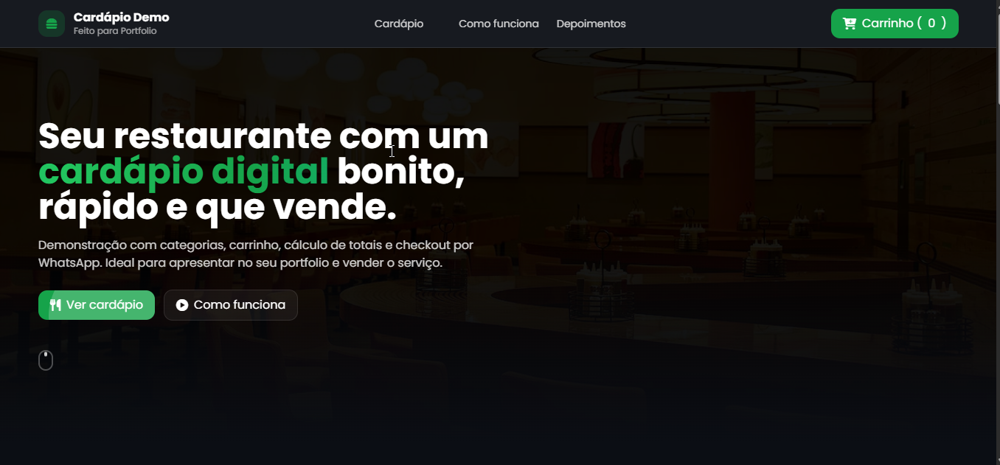
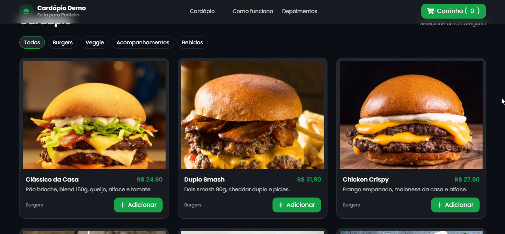
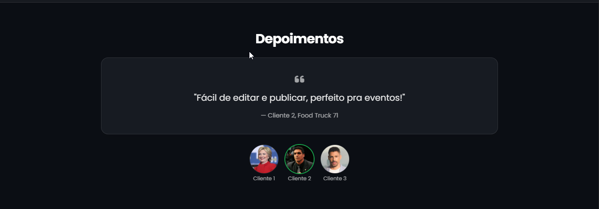
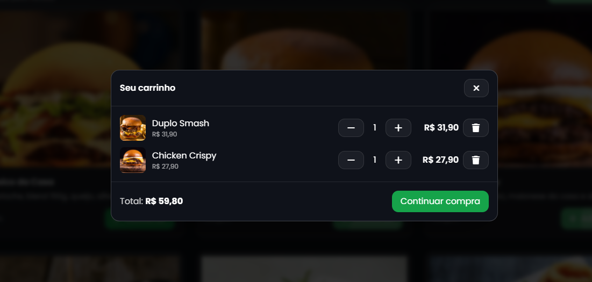
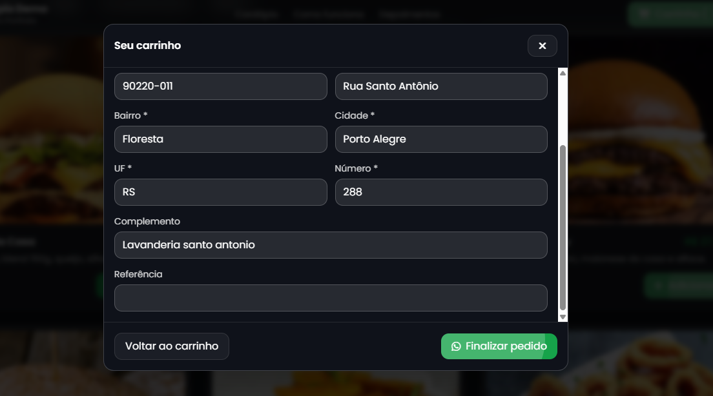
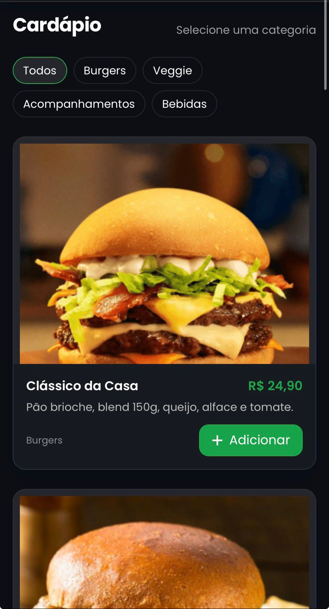
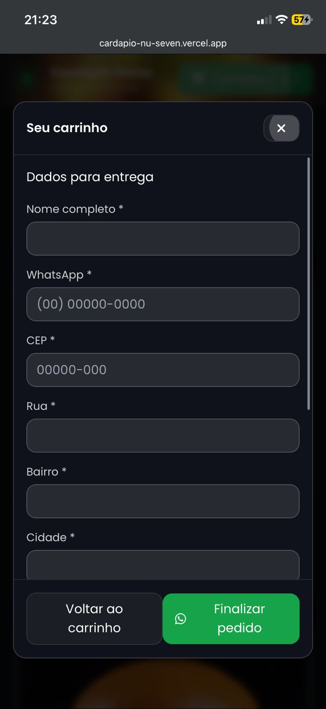
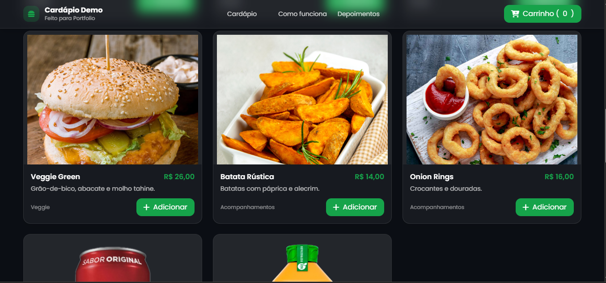

# Cardápio Demo — Portfolio (v1.2)

Uma landing e um cardápio digital estático com **carrinho**, **checkout via WhatsApp** e **área administrativa** de itens.  
Pensado para **portfolio/vendas**: rápido de adaptar, bonito e com animações modernas.

> **Versão:** 1.2 • **Data:** 2025-10-06

---

## 🧭 Sumário

- [O que tem de novo (v1.2)](#-o-que-tem-de-novo-v12)
- [Screenshots](#-screenshots)
- [Demo local](#-demo-local)
- [Estrutura do projeto](#-estrutura-do-projeto)
- [Configuração rápida](#-configuração-rápida)
- [Admin (CRUD de itens)](#-admin-crud-de-itens)
- [Build do CSS (Tailwind)](#-build-do-css-tailwind)
- [Dicas de conteúdo](#-dicas-de-conteúdo)
- [Deploy](#-deploy)
- [Licença](#-licença)

---

## ✨ O que tem de novo (v1.2)

- **Hero cinematográfico**
  - Animação _stagger_ por palavra no título
  - Destaque “**cardápio digital**” com gradiente/shine
  - Parallax leve do background
  - CTAs com _magnetic hover_ + _ripple_
  - Indicador “scroll” sutil
- **Depoimentos interativos:** fotos embaixo; conteúdo aparece ao clicar; avatar selecionado pulsa.
- **Modal do carrinho** sólido com **fade-in/out** e **pop/pop-out**.
- **Reveal on Scroll** (IntersectionObserver) com **fallback** para navegadores antigos.
- **Qualidade de vida:** imagens com `loading="lazy"`, toasts, contagem do carrinho pulsando, etc.

---

## 📸 Screenshots

**DESKTOP**

<p align="center">
  
</p>

<p align="center">
  
</p>

<p align="center">
  
</p>

<p align="center">
  
</p>

<p align="center">
  
</p>

<p align="center">
  
</p>

**MOBILE**

<p align="center">
  
</p>

<p align="center">
  
</p>

<p align="center">
  
</p>

<p align="center">
  
</p>

<p align="center">
  
</p>

<p align="center">
  
</p>

<details>
  <summary>Ver lado a lado (opcional)</summary>

**DESKTOP**

  <p align="center">
    
    
    
    
    
    
    
  </p>

**MOBILE**

  <p align="center">
      
      
      
      
      
      
    </p>
</details>

---

## 🚀 Demo local

1. **Baixe o ZIP** e extraia.
2. Abra a pasta no VS Code e use **Live Server** _ou_ rode um servidor simples:
   - Python: `python -m http.server 5500`
   - Node: `npx http-server . -p 5500`
3. Acesse: `http://localhost:5500/index.html`

---

## 🗂 Estrutura do projeto

```
.
├── index.html
├── admin.html
├── script.js
├── admin.js
├── styles/
│   ├── input.css
│   └── output.css
├── assets/
│   ├── header.png
│   ├── cardapio.png
│   ├── bg.png
│   ├── hamb-*.png
│   └── avatars/
│       ├── cliente-1.jpg
│       ├── cliente-2.jpg
│       └── cliente-3.jpg
└── tailwind.config.js
```

---

## ⚙️ Configuração rápida

- **Telefone do WhatsApp:** no `script.js` altere `WHATS_PHONE`:
  ```js
  const WHATS_PHONE = "+55DDDSEUNUMERO";
  ```
- **Open Graph:** ajuste o título/descrição/imagem no `<head>` do `index.html`.
- **Catálogo:** edite o array `PRODUCTS` (id, name, price, image, category, desc).
- **Depoimentos:** coloque as fotos em `assets/avatars/cliente-*.jpg` e edite o array `TESTIMONIALS`.

> Dica: otimize as imagens (`.webp`/`.png`) e evite espaços no nome do arquivo.

---

## 🛠 Admin (CRUD de itens)

Abra `admin.html` para:

- **Criar/editar/remover** itens do cardápio;
- **Filtrar por categoria** e **buscar por nome**;
- **Exportar JSON** dos itens ou **Importar JSON** salvo;
- **Repor defaults** (se `DEFAULTS_PLACEHOLDER` estiver configurado).

---

## 🎨 Build do CSS (Tailwind)

O projeto já inclui `styles/output.css`. Só refaça o build se mudar tokens/animações.

```bash
npm i -D tailwindcss
npx tailwindcss -i ./styles/input.css -o ./styles/output.css --watch
```

O `tailwind.config.js` contém **keyframes** e **animations** usados.

---

## ✍️ Dicas de conteúdo

- **Texto do herói:** curto e direto, com palavra-chave destacada.
- **Imagens:** 4:3 ou quadradas; `object-contain` pra não cortar.
- **Depoimentos:** frase forte + nome curto + função/empresa.
- **Acessibilidade:** `alt` nas imagens e bom contraste.

---

## ☁️ Deploy

- **Netlify:** arraste a pasta ou conecte o repositório.
- **Vercel:** import do repo. Se pedir “Output Directory”, use **`.`** ou configure `vercel.json`.
- **GitHub Pages:** branch com os arquivos na raiz; habilite Pages.

---

## 📒 Changelog — v1.2

- Hero com **stagger por palavra**, gradiente/shine e **parallax** suave.
- **Ripple** e _magnetic hover_ nos botões.
- **Modal** do carrinho com _fade/pop_.
- **Depoimentos** por avatar com fade-in.
- **Reveal on Scroll** com fallback.
- Micro animações e `lazy-loading`.

---

## 🧾 Licença

[MIT](https://opensource.org/licenses/MIT). Ícones/libs: Font Awesome, Toastify, TailwindCSS.

---

### Suporte & ideias

Ficou com dúvida ou quer levar isso para um **cardápio real** (com painel + backend)? Abra uma issue ou chame. :)
